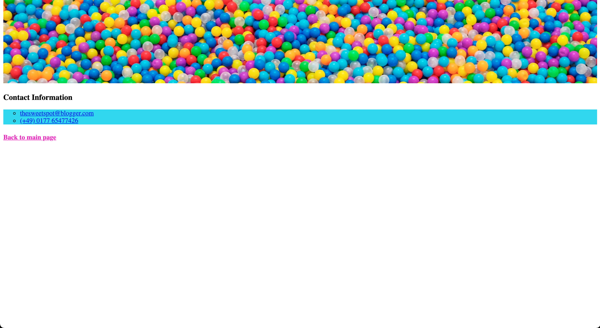

# The Sweet Spot v2

Let's improve upon our previous exercise by adding some images. Have a look at the new and improved page [here](https://digitalcareerinstitute.github.io/UIB-content-the-sweet-spot-v2/index.html)

#### Main Page

#### Contact Page

### Instructions

> - Use `index.html` and `contact.html` to create the page
> - All the images we'll be using can be found in the `images` folder
> - `contact-header.jpeg` and `main-header.jpg` should be added to the top of the _contact_ and _header_ pages respectively
> - The images in the _Our Treats_ section (`candy-floss.jpg`, `jellybeans.jpg`, `lollipop.jpg`) need to be floated alongside the text with a `border-radius` and `border` applied
> - Each image should be linked to the wiki page for the respective treat. For example, when the user clicks on the _lollipop_ image, they should go to the Wikipedia page for **lollipop**
> - We can again use http://www.cupcakeipsum.com/ for the dummy text in the _Our Treats_ section
> - Classes, IDs and CSS selectors should be used where appropriate
> - As always, try to make your webpage as pixel-perfect to the references as possible

[//]: # (autograding info start)
#  Results
> ⌛ Give it a minute. As long as you see the orange dot  on top, CodeBuddy is still processing. Refresh this page to see it's current status.
>
> This is what CodeBuddy found when running your code. It is to show you what you have achieved and to give you hints on how to complete the exercise.

### HTML basics

|                 Status                  | Check                                                                                    |
| :-------------------------------------: | :--------------------------------------------------------------------------------------- |
|  | `index.html` should have appropriate meta tags |
|  | `index.html` should have a title tag |
|  | Images should be used |

### Header

|                 Status                  | Check                                                                                    |
| :-------------------------------------: | :--------------------------------------------------------------------------------------- |
|  | Homepage Should use header image |

### Our Treats

|                 Status                  | Check                                                                                    |
| :-------------------------------------: | :--------------------------------------------------------------------------------------- |
|  | Lollipop Image should be floated left of the text |
|  | Lollipop Image should have a border |
|  | Lollipop Image should have border-radius set |
|  | Multiple background colors should be used |
|  | Candy-floss Image should be floated right of the text |
|  | Candy-floss Image should have a border |
|  | Candy-floss Image should have border-radius set |
|  | Jelly Bean Image should be floated alongside the text and have border & border-radius set |
|  | Images should be linked to their respective wikipedia pages |

### Contact Page

|                 Status                  | Check                                                                                    |
| :-------------------------------------: | :--------------------------------------------------------------------------------------- |
|  | The 'Drop me a line' link Should redirect to `contact.html` page |
|  | Contact Page Should contain a 'go back' link to index.html |
|  | Contact page exists |

[🔬 Results Details](../../actions)
[🐞 Tips on Debugging](https://github.com/DCI-EdTech/autograding-setup/wiki/How-to-work-with-CodeBuddy)
[📢 Report Problem](https://docs.google.com/forms/d/e/1FAIpQLSfS8wPh6bCMTLF2wmjiE5_UhPiOEnubEwwPLN_M8zTCjx5qbg/viewform?usp=pp_url&entry.652569746=UIB-content-the-sweet-spot-v2)

[//]: # (autograding info end)